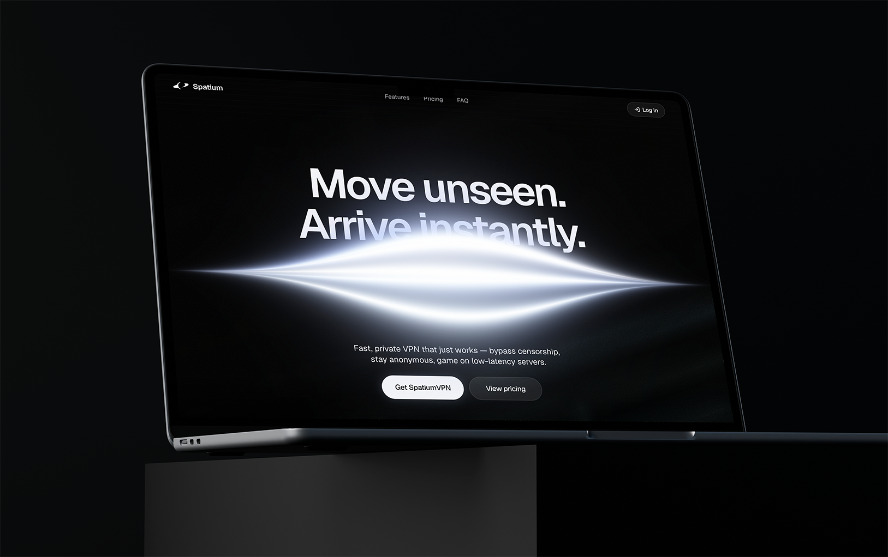
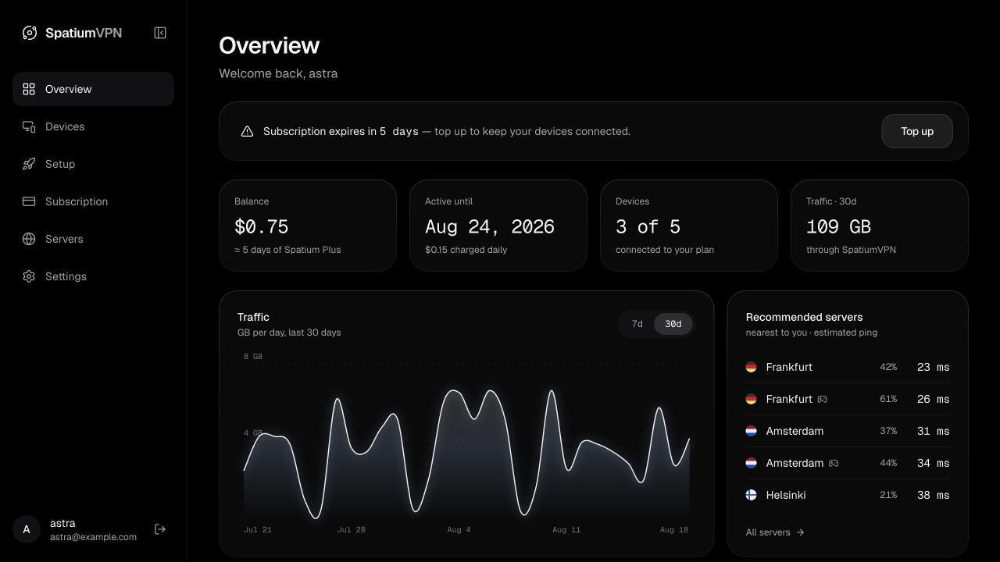

<h1 align="center">SpatiumVPN</h1>

<p align="center">
  <strong>Move unseen. Arrive instantly.</strong>
</p>

<p align="center">
  A cinematic product concept for a private, censorship-resistant VPN — explored across a landing page, 
  account dashboard, and mobile client.
</p>

<p align="center">
  
  
  
  
  
</p>

> [!IMPORTANT]
> SpatiumVPN is a **front-end portfolio project**, not a working VPN service. Authentication, traffic, billing, 
devices, servers, and connection states are simulated locally; there is no production backend or VPN tunnel.

## About the project

SpatiumVPN is a high-fidelity exploration of what a modern privacy product could feel like. The project treats the
marketing site, customer dashboard, and mobile client as one product rather than three unrelated mockups.

Its visual system is deliberately restrained: near-black surfaces, Geist typography, fine borders, translucent
materials, and cold blue-white light used as the only accent. Custom WebGL shaders provide atmosphere without turning
the interface into a generic neon dashboard.

### Included experiences

- **Marketing landing page** — animated hero, censorship-resistance story, technical diagrams, smooth scrolling, and responsive layouts.
- **Customer dashboard** — overview, traffic chart, device management, setup flow, subscription controls, server status, and account settings.
- **Mobile client prototype** — an interactive connection state machine, server selection, live session timer, traffic estimate, and deterministic states for screenshots.
- **Design sandbox and export tools** — isolated component studies, a repeatable mobile screenshot workflow, and transparent WebGL exports for design handoff.

## Interface

<table>
  <tr>
    <td width="68%" align="center">
      
    </td>
    <td width="32%" align="center">
      
    </td>
  </tr>
  <tr>
    <td align="center"><sub>Responsive account dashboard</sub></td>
    <td align="center"><sub>Mobile connection prototype</sub></td>
  </tr>
</table>

## Design and engineering highlights

- Custom OGL fragment shaders for the hero strands, connection core, ice ridge, and privacy light.
- Motion orchestration with entrance sequences, layout transitions, glass reveals, and a reduced-motion path.
- Technical SVG/DOM diagrams that explain product ideas separately from decorative shader effects.
- Lazy-loaded visual effects and render loops that pause when content is off-screen or the document is hidden.
- Responsive navigation with a collapsible desktop sidebar and mobile drawer.
- Deterministic mock data and URL-controlled mobile states for reproducible visual testing.
- A compact token system where color appears primarily through light rather than solid accent fills.

## Tech stack

| Layer    | Tools                                      |
| -------- | ------------------------------------------ |
| UI       | React 19, TypeScript 6, React Router 8     |
| Styling  | Tailwind CSS 4, custom CSS, Geist Variable |
| Motion   | Motion for React, Locomotive Scroll        |
| Graphics | WebGL via OGL, SVG                         |
| Tooling  | Vite 8, Oxlint, Prettier, Puppeteer Core   |

## Getting started

### Requirements

- Node.js `20.19+` or `22.12+`
- npm

### Run locally

```bash
git clone https://github.com/p0wered/spatium-vpn.git
cd spatium-vpn
npm install
npm run dev
```

Vite will print the local development URL, usually `http://localhost:5173`.

The login screen is intentionally mocked: any email and password will open the dashboard.

## Routes

| Route             | Purpose                                     |
| ----------------- | ------------------------------------------- |
| `/`               | Marketing landing page                      |
| `/login`          | Mock sign-in flow                           |
| `/dashboard`      | Account overview and nested dashboard pages |
| `/app`            | Fixed-size mobile client prototype          |
| `/dev`            | Internal design-system sandbox              |
| `/export/strands` | Deterministic WebGL export surface          |

### Reproducing mobile states

The mobile prototype accepts query parameters so a state can be opened directly without clicking through the UI:

```text
/app?state=connected&t=41:12&server=ams-1&sheet=open&tab=home
```

Supported controls include `state`, `t`, `server`, `sheet`, `tab`, and `live=1`. Forced states remain frozen by default,
which keeps generated screenshots consistent.

## Available scripts

| Command                  | Description                                                    |
| ------------------------ | -------------------------------------------------------------- |
| `npm run dev`            | Start the Vite development server                              |
| `npm run build`          | Type-check and create a production build                       |
| `npm run preview`        | Preview the production build locally                           |
| `npm run lint`           | Run Oxlint                                                     |
| `npm run format`         | Format the repository with Prettier                            |
| `npm run shoot`          | Capture mobile states and composite them into the iPhone frame |
| `npm run export:strands` | Export a deterministic transparent PNG of the hero shader      |

The screenshot script expects the dev server to be running and uses a locally installed Chrome, Chromium, or Microsoft 
Edge. Set `CHROME_PATH` if the browser is installed elsewhere.

## Project structure

```text
src/
├── app/                 # Router configuration
├── components/          # Shared UI, diagrams, and WebGL backgrounds
├── data/                # Deterministic product mock data
├── lib/                 # Session, formatting, and scrolling helpers
└── pages/
    ├── landing/         # Marketing experience
    ├── dashboard/       # Account portal
    ├── app/             # Mobile client prototype
    ├── login/           # Mock authentication
    ├── dev/             # Component sandbox
    └── export/          # Shader export surface

docs/design/             # Visual studies and design decision history
scripts/                 # Screenshot and asset export utilities
```

## Current scope

The repository is intentionally focused on product design and front-end behavior. A real release would still require a 
VPN engine, protocol implementation, secure authentication, server APIs, persistent storage, payments, infrastructure, 
operational monitoring, and an independent security review.
