# Bypass section: design direction

Status: Ice Ridge and the Public / Hidden Endpoint technical diagram are selected and implemented. Five technical concept iterations remain documented as design history.

This document records the design conclusions for `src/pages/landing/Bypass.tsx`. The generated images are silhouette and composition studies. They are not pixel-perfect promises and must only be selected if the effect can be reproduced with a small fullscreen WebGL shader.

## Product and audience

Spatium is positioned as a VPN for people who already understand the practical reality of censorship, DPI and unstable access, but the landing page must not require protocol-level knowledge to understand the benefit.

The section therefore has two communication levels:

1. The heading and paragraph explain the outcome in ordinary language.
2. The technical graphic adds credibility and rewards a technically prepared visitor without becoming a prerequisite for understanding.

Do not bind this section to one transport or protocol. Spatium is meant to use multiple protocols, but the visual must not imply that censorship resistance is merely transport failover. The stronger invariant is: the encrypted session can remain on one protocol while its observable wire image is made harder to classify.

## Composition system

The centered and symmetrical composition is intentional. It follows the repeated stage structure seen on Reflect: each section preserves the same centered reading rhythm, while the silhouette of the decorative object changes.

The section should keep this order:

1. Abstract WebGL accent outside the technical container.
2. Centered heading and short paragraph.
3. Large translucent container.
4. Independent technical SVG or real UI inside the container later.

The exact overlap between the first two layers may vary. The light can sit above the copy, behind the negative space around it, or between the paragraph and container. It must never reduce text contrast.

Symmetry is not the source of monotony here. Reusing the same light topology is. The site can keep a centered scaffold if each section has a recognizably different silhouette, spatial behavior and motion profile.

## Separation of roles

### Abstract layer

- WebGL or OGL fragment shader.
- Decorative and atmospheric only.
- No labels, nodes, packets, protocol names or implied process.
- Lives outside the technical container.
- May create a soft highlight that the glass shell catches.

### Technical layer

- Crisp SVG, canvas or real DOM UI.
- Explains or suggests how blocking resistance works.
- Lives inside the technical container.
- Must remain sharp and visually independent from the abstract light.
- Selected direction: **Public / Hidden Endpoint**, based on authenticated camouflage being an intended Spatium capability.

### Allowed physical interaction

The container may blur or soften the external light behind its upper edge. This is a material relationship, not a semantic merge. The technical graphic must not distort with the decorative shader.

If `backdrop-filter` is inconsistent in Safari or creates excessive GPU cost, use a second low-resolution light pass clipped to the shell as a controlled approximation. Do not implement full scene refraction.

## Abstract concept set

### Existing idea: Ice Ridge

Strengths:

- Works naturally with the top edge of the glass container.
- Easy to implement and tune.
- Matches the current cold-light palette.

Weakness:

- It is still very close to Hero's Strands topology: a luminous horizontal field reduced to one cleaner line. Removing waviness does not create a new visual family by itself.

**Selected and implemented for Bypass.** The final version uses a dedicated lightweight OGL pass rather than configuring Hero's multi-strand shader. This keeps the relationship to Hero in the light palette while making the responsive geometry and intensity independent.

Implementation notes:

- One fullscreen triangle and one fragment shader.
- A straight white core with a cold steel-blue falloff.
- Faster horizontal fade at the sides and a broader central haze.
- Subtle brightness breathing only; no waviness or positional movement.
- The lower half sits behind the translucent shell so `backdrop-filter` softens it.
- The ridge width is controlled in shader space and ends just inside the shell edges; the oversized canvas is retained only to keep the vertical bloom unclipped.
- Its entrance starts after the shell has appeared as a central ignition pulse. The horizontal decay lengthens continuously and settles into the final ridge; there is deliberately no traveling clip edge or pair of bright fronts that could read as curtains opening.
- The glass itself is never opacity-animated. A separate black veil reveals the already-final material, avoiding the `backdrop-filter` compositor jump at the end of an ancestor fade.
- The render loop pauses outside the viewport and renders one stable frame for reduced motion.
- DPR is capped at `1.25` because the effect is intentionally soft.

### Variant A: Curtain

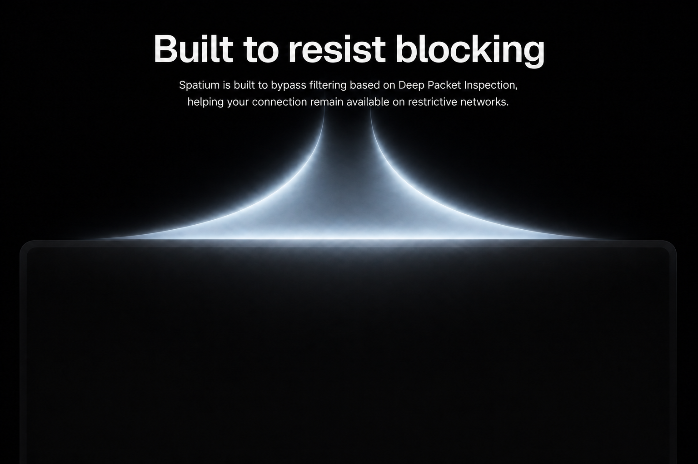

A single symmetric membrane with two concave sides opening toward the container. The sides approach a narrow dark channel but never meet. Each side fades independently into black above.

Implementation envelope:

- One fullscreen triangle.
- One signed-distance boundary for the membrane.
- A minimum center gap that prevents the two boundaries from forming an apex.
- Two or three smooth gradient bands.
- Low-amplitude domain warp for slow breathing motion.
- A separate soft bloom term, not post-processing.

Assessment:

- Best continuity with the current Bypass composition.
- More distinct from Strands than Ice Ridge because it reads as one surface, not a family of ribbons.
- The open upper channel removes the tent-like peak and makes the silhouette feel less like a closed object.
- A broad translucent fill now illuminates almost the entire membrane. It remains brightest at the curved rims and base, then softens toward the center without becoming empty black.
- Interior fill and exterior bloom are separate parameters. The selected revision keeps the dense v3 interior but returns the narrow, restrained v2 exterior glow so the surrounding black stays clean.
- Still shares the same vertical story as Ice Ridge: light grows out of the container edge. Neighboring sections should not repeat edge-born light.
- **Archived exploration.** Curtain is no longer selected for Bypass, but the revisions remain useful references for a future section that needs a vertical membrane.

### Variant B: Halo

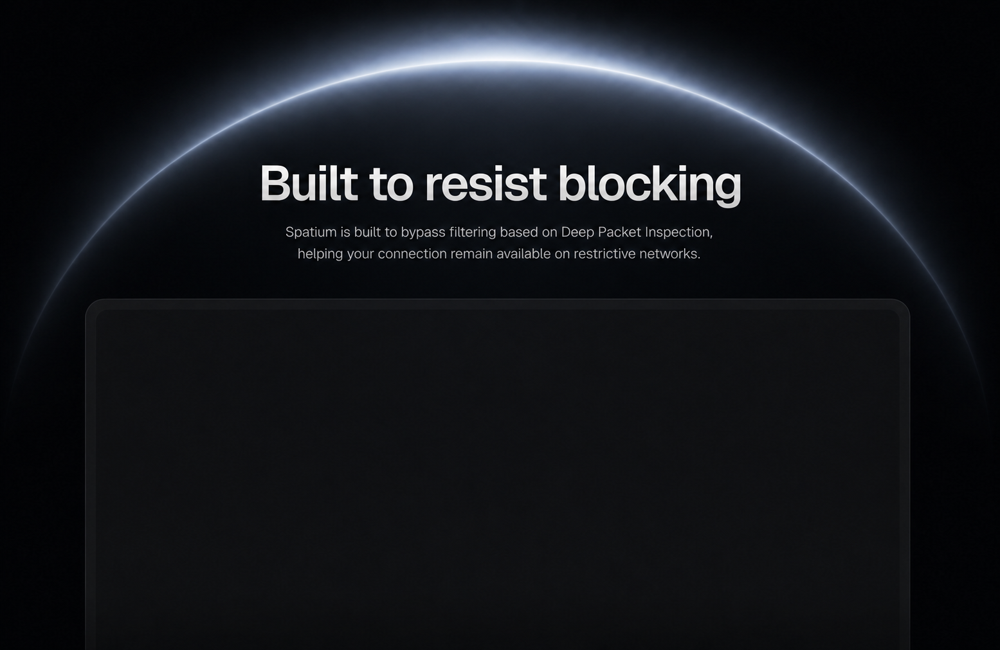

A giant low circular arc forms an architectural canopy around the centered copy. Only a small portion of the ring is bright.

Implementation envelope:

- One fullscreen triangle.
- Circle or ellipse SDF: distance to radius plus a crop mask.
- One bright core and two soft falloff bands.
- Extremely slow radius or center drift, if any.

Assessment:

- Strongest break from Hero because its governing geometry is radial rather than linear or ribbon-based.
- The most immediately legible silhouette at a glance.
- The full high arc intentionally keeps a visible relationship with Reflect. That resemblance is accepted.
- The halo must remain the only decorative light. Do not add a separate horizontal glow above the container.
- **Reserved for a future section.** Do not use it in Bypass now.

### Variant C: Fold

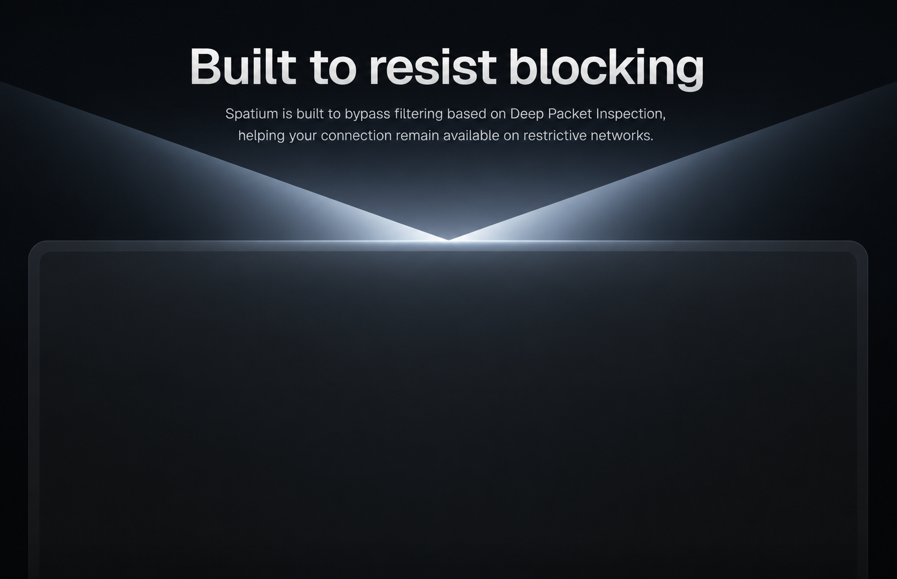

Two broad light planes converge into a central seam above the container.

Implementation envelope:

- One fullscreen triangle.
- Two oriented SDF bands or half-plane masks.
- Smooth union near the center seam.
- Soft curvature or very low-frequency distortion to avoid rigid triangles.
- No geometry, camera or lighting engine.

Assessment:

- Most independent from both Hero and Reflect.
- Simple enough for the current stack.
- The generated version is too hard-edged and currently reads as two spotlights or a stage opening. That metaphor is not useful for bypassing censorship.
- **Rejected.** Do not continue this direction for the current landing page. The file remains only as design-history evidence.

## Current decision

1. **Bypass:** use the implemented Ice Ridge.
2. **Future reserve:** keep the full high Halo without a horizontal container glow.
3. **Future reserve:** keep Curtain v4 as a vertical light-membrane direction.
4. **Rejected:** Fold.

The earlier `curtain.png`, `curtain-v2.png`, `curtain-v3.png` and `halo.png` are retained for visual comparison. The reserved references are `curtain-v4.png` and `halo-v2.png`.

## Technical stack decision

Keep the existing `ogl` dependency for this exploration.

All four current abstract directions, including Ice Ridge, can be built with a fullscreen triangle and a fragment shader. Three.js would add bundle weight and abstraction without improving these 2D light fields.

Introduce Three.js only if a later approved direction genuinely requires at least one of the following:

- Perspective camera and real 3D geometry.
- Mesh deformation or skeletal animation.
- Multiple render passes or substantial post-processing.
- Shared 3D objects across several sections.

Do not add Three.js merely to make a shader feel more sophisticated.

## Motion and performance boundaries

- Motion exists to make the light feel alive, not to explain the bypass process.
- Prefer one slow parameter change over several independent oscillations.
- No pointer tracking is required. If added later, interpolate it outside React state and keep the response subtle.
- Stop rendering when the section is offscreen or the document is hidden.
- Cap DPR around `1.25` to `1.5` for the soft light pass.
- Use a low-resolution canvas when possible. Blur hides resolution loss.
- `prefers-reduced-motion` should render one stable frame using a chosen `staticTime`.
- Avoid particles, true volumetric fog, framebuffer feedback and full optical refraction.
- Audit the existing `backdrop-filter: blur(48px)`. A lower value or clipped duplicate pass may be cheaper and visually cleaner.

## What to do

- Keep the centered section rhythm.
- Use one dominant abstract silhouette per section.
- Keep the cold light palette already defined by the project.
- Let the glass shell catch the light only near its upper edge.
- Judge every concept first as a static black-and-white silhouette.
- Make the technical graphic understandable without watching an animation.
- Keep broad-audience copy primary and technical detail secondary.

## What not to do

- Do not combine the WebGL light and technical SVG into one explanatory diagram.
- Do not place glowing nodes, packet trails or protocol labels in the abstract layer.
- Do not reuse Strands with only different `count`, `waviness` or `thickness` values and call it a new visual.
- Do not use film-grade CGI references as an implementation target.
- Do not add a row of small dashboard cards, transport pills or decorative system labels.
- Do not make the technical drawing glow like the decorative light. It should resemble documentation, not neon UI.
- Do not fake engineering precision with invented packet counts, latency values or success percentages.
- Do not allow the accent to become brighter than the heading or erase the container edge.

## Copy note

The current source says `Build to resist blocking`. Grammatically and semantically, `Built to resist blocking` is stronger because it describes the product rather than giving the visitor an instruction. The concept images use the corrected version, but production copy should only be changed as part of the later implementation decision.

## Technical graphic exploration

All three directions are protocol-agnostic, use crisp SVG geometry, and make no claims about packet counts, latency, success rates or a specific transport implementation. The static frames deliberately share the same shell, type scale, line weight and density so the concept can be judged independently from polish.

### Transport Switching Matrix — rejected explanatory model

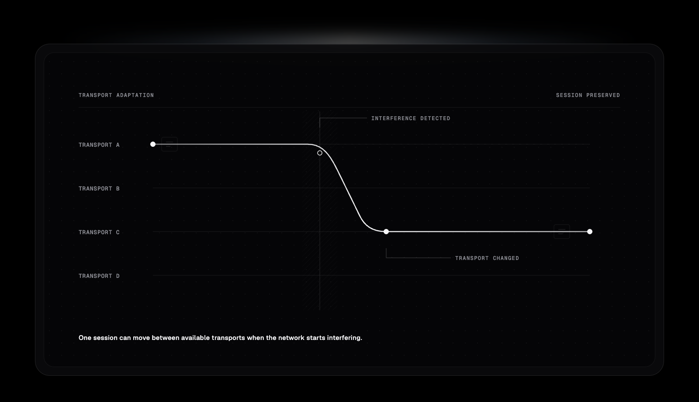

One preserved session moves from one available transport lane to another after network interference is detected.

- Explains multiprotocol adaptation.
- Rejected for Bypass because it reads as generic failover and does not explain how a single protocol can resist DPI classification.

### Detection Pipeline

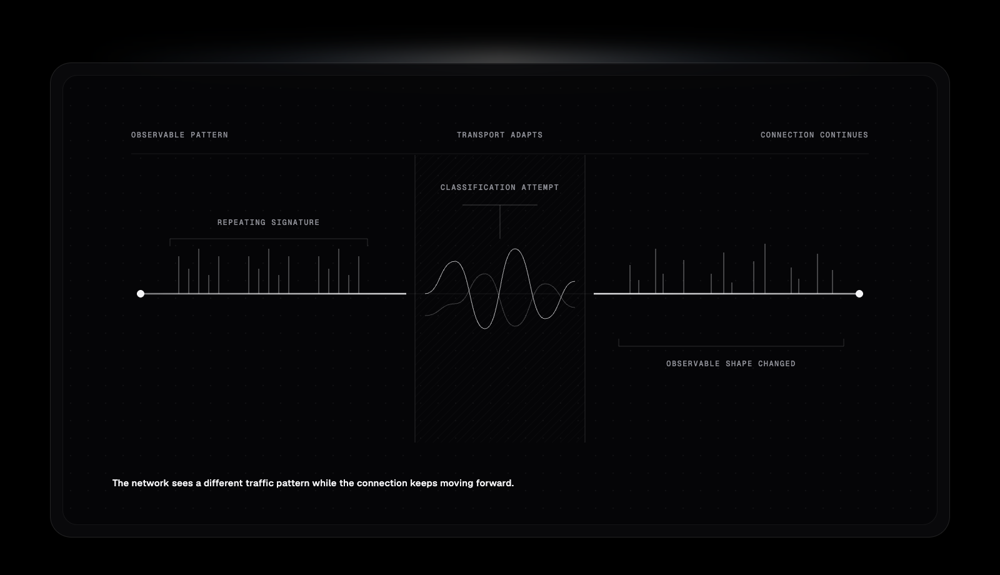

A repeating observable signature enters a classification zone, changes shape, and continues in a less repetitive form.

- Closest to the actual DPI claim without naming a concrete protocol.
- Weakness: depends most heavily on labels and can collapse into decorative waveform art.

### Connection Timeline — rejected explanatory model

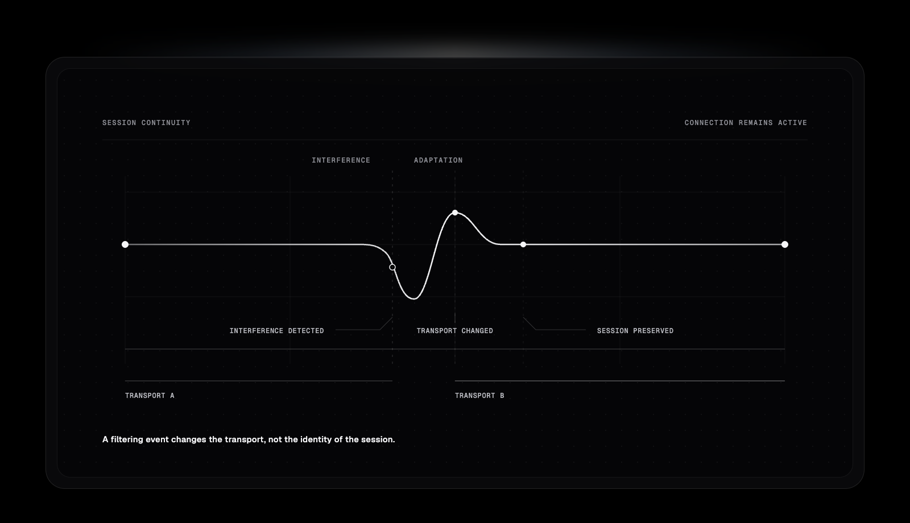

An observability-style trace shows interference, a transport change and preservation of the same session over time.

- Clear continuity story, but it again implies that bypass is a transport change.
- Rejected for Bypass because it explains recovery after failure rather than resistance on the wire.

The PNG files are review previews. The SVG files in the same directory are editable source artifacts; the selected iteration-5 direction is redrawn as a responsive production component rather than embedding a concept image.

## Research correction: bypass is not synonymous with fallback

The first exploration over-weighted transport orchestration. Current censorship-resistant protocols show a more useful model:

- Hysteria 2 stays on QUIC while presenting itself as HTTP/3 to unauthenticated observers. Its Gecko layer fragments and randomly pads the distinctive QUIC handshake shape; its Mimic integration can rewrite UDP packets to look like TCP while the application still speaks QUIC over UDP.
- AmneziaWG keeps the WireGuard architecture while protecting low-entropy headers, varying message padding and timing, and adding junk or custom signature packets before a handshake.
- REALITY modifies the TLS-facing layer so its handshake and outside traffic shape resemble an ordinary target website.
- An active censor can do more than passively inspect bytes. Hysteria's unauthenticated path therefore behaves like a normal web server or reverse proxy, while only an authenticated request turns the same QUIC connection into a proxy connection.

This does not mean every protocol uses every technique. The shared design idea is narrower and defensible: **the tunnel can remain stable while the evidence available to the censor changes**.

There is no honest “invisible VPN” state. A censor may combine handshake fields, packet length and direction, timing, active probes, IP reputation and regional allowlists. Obfuscation changes the classifier's evidence and raises the cost of a reliable block; it does not guarantee permanent indistinguishability. Even the HTTP/3 specification notes that predictable randomized padding can provide very little protection.

Primary sources:

- [Hysteria 2 protocol specification](https://v2.hysteria.network/docs/developers/Protocol/)
- [Hysteria 2 Mimic documentation](https://v2.hysteria.network/docs/advanced/Mimic/)
- [AmneziaWG implementation documentation](https://github.com/amnezia-vpn/amneziawg-go)
- [Project X REALITY documentation](https://xtls.github.io/en/config/transports/reality.html)
- [OONI measurements of Russian blocking techniques](https://ooni.org/post/2022-russia-blocks-amid-ru-ua-conflict/)
- [HTTP/3 specification: padding and traffic analysis](https://datatracker.ietf.org/doc/html/rfc9114#section-10.7)

## Technical graphic exploration: iteration 2

All three frames keep one connection or one protocol in view. None shows a fallback to a second transport.

### Two Observers

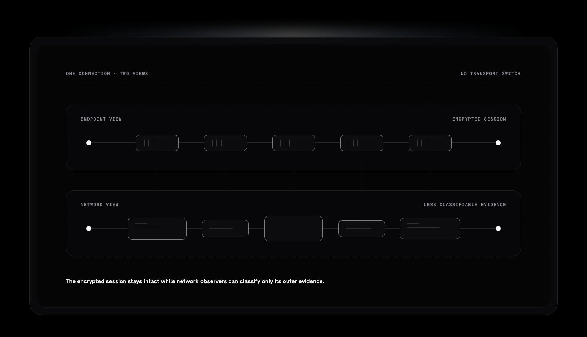

The upper row is the stable encrypted session known to the endpoints. The lower row is the outer evidence available to a network observer. It is deliberately less classifiable, but not universally disguised as web traffic.

- Broadest and most protocol-agnostic explanation.
- Makes the key distinction—private session versus observable evidence—without pretending to show a literal packet capture.
- Weakness: it explains _what_ changes more clearly than _how_ it changes.

### Authenticated Camouflage

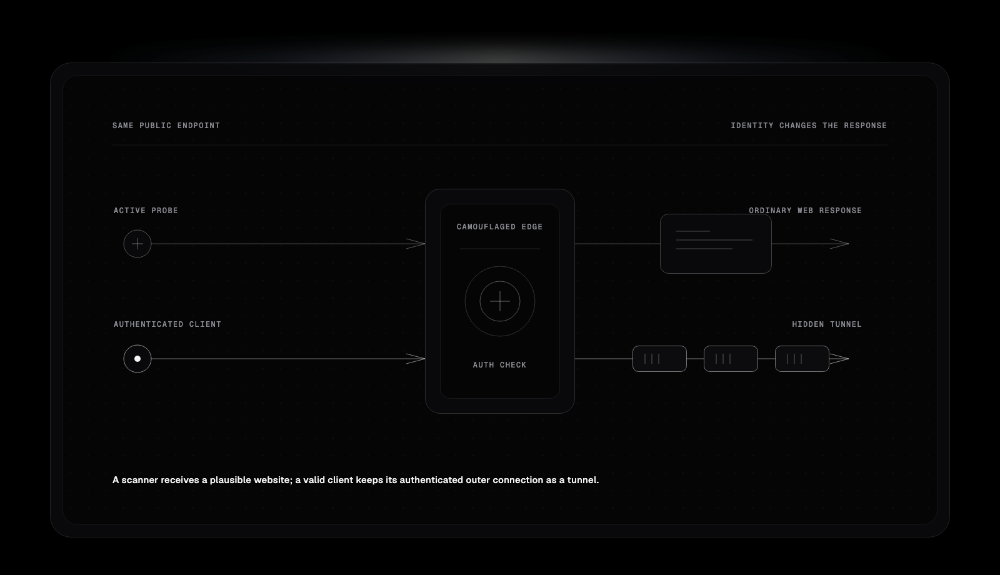

The same public endpoint responds differently to an unauthenticated active probe and a valid client.

- Most concrete explanation of active-probe resistance and decoy web behavior.
- Strong technical credibility because the branching is by observer identity, not by transport failure.
- Weakness: narrower than the product claim; not every censorship-resistant protocol uses a decoy website or authenticated camouflage.

### Mutable Envelope

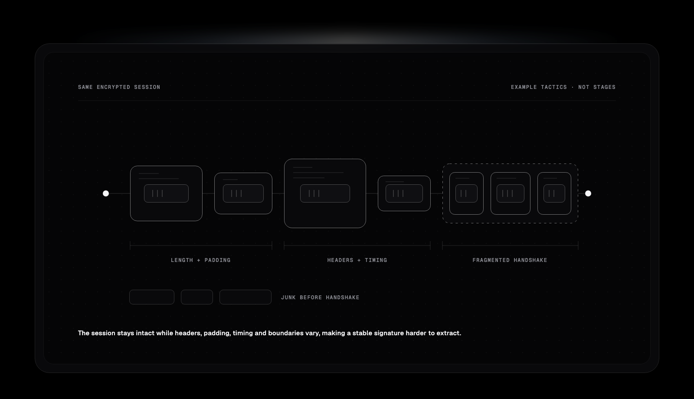

A continuous logical session sits inside examples of outer packets whose headers, lengths, padding, timing and boundaries can vary. The groups are alternative tactics, not a mandatory processing sequence.

- Best depiction of how a recognizable fingerprint can be made less stable and less recognizable without changing the inner session.
- Remains compatible with several implementations rather than naming one protocol.
- Weakness: viewers may read it as generic packet encryption unless the labels remain present.

Iteration-2 conclusion: **Two Observers** was the strongest semantic model, but the set was too block-dominant to become the final visual direction. **Authenticated Camouflage** remains valid only if that behavior is a real product capability.

## Technical graphic exploration: iteration 3

The second iteration corrected the mechanism but relied too heavily on rounded packet containers. This third exploration restores the line and graph language of the first set without returning to the false transport-switching story. All plotted structures are conceptual diagrams, not measured telemetry.

### Signature Stack

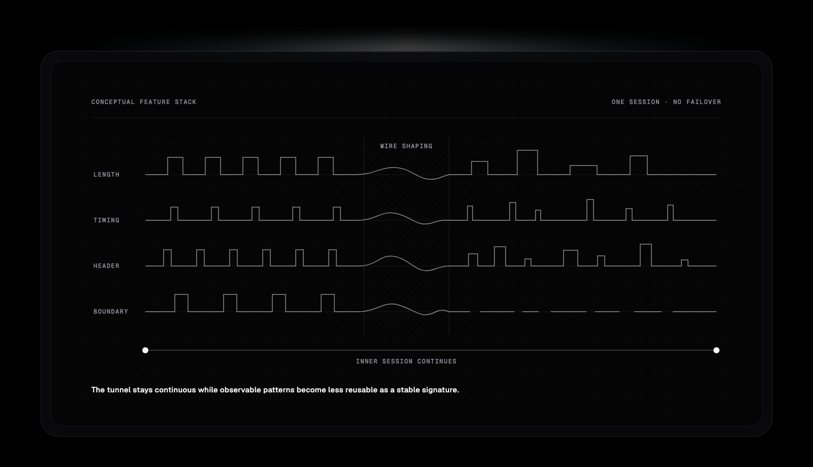

Four observable feature channels move from repeated patterns to distinct, less reusable shapes while a separate inner-session line remains uninterrupted.

- Most direct compromise between technical accuracy and the expressive line language of the first iteration.
- Shows _how_ a classifier's evidence changes without inventing values or switching transports.
- Weakness: still reads as a left-to-right transformation and therefore needs the persistent inner-session line and copy.

### Classifier Field

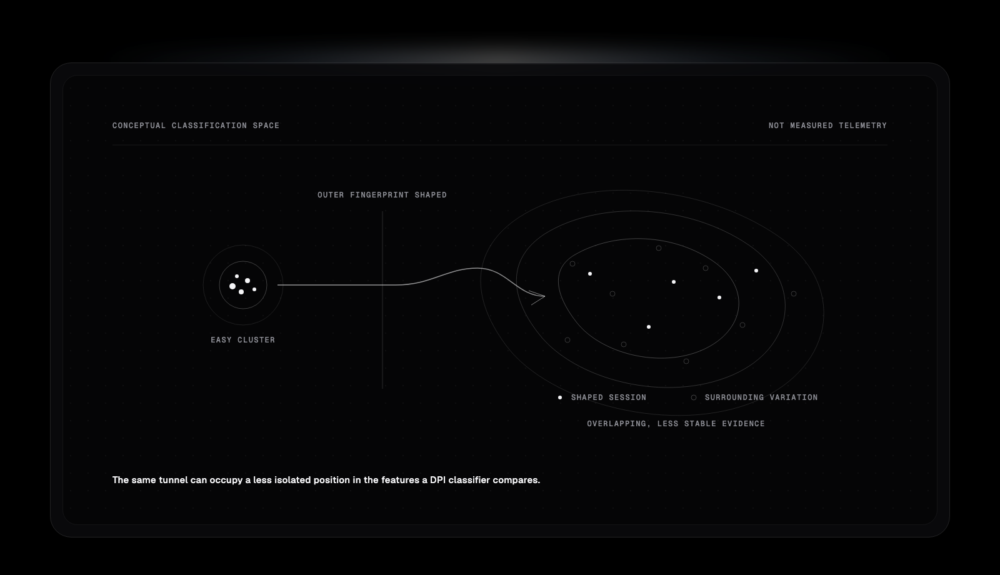

A schematic feature-space diagram maps the outer fingerprint from an isolated, easy-to-classify cluster into surrounding traffic variation. Filled and hollow samples represent the two conceptual populations; they are not measurements.

- Most visually distinctive and closest to research/observability graphics.
- Explains the actual objective of obfuscation: make reliable classification harder, not make encryption magically invisible.
- Weakness: the abstraction requires technically literate visitors and must remain explicitly labeled as conceptual rather than measured product telemetry.

### Probe Gate

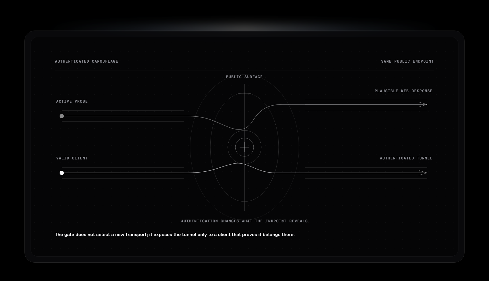

An optical-style line diagram shows the same public surface returning plausible web behavior to a probe while exposing the tunnel to a valid client.

- Most expressive version of authenticated camouflage and active-probe resistance.
- Branching is caused by authentication, not failure or failover.
- Weakness: it remains a specific capability claim and should not be selected unless Spatium genuinely implements decoy behavior.

Iteration-3 conclusion: **Signature Stack** was the safest golden mean before the research question was narrowed from generic traffic shaping to the specific survival of VLESS/REALITY/Trojan-style systems under protocol blocking.

## Research correction: surviving a block on the VPN itself

The decisive comparison is not “direct connection versus VPN.” It is “a tunnel with a cheap, protocol-specific fingerprint versus a tunnel whose public surface overlaps ordinary web traffic.”

The terms must stay technically separate:

- **VLESS** is a lightweight authenticated proxy protocol. Current Xray documentation says it normally requires an outer transport-security layer. VLESS alone is not the browser-like camouflage.
- **REALITY** is a modified TLS-facing security layer. It borrows the appearance and handshake characteristics of a target site and can use a browser fingerprint. Traffic that fails REALITY authentication is forwarded to the configured target instead of revealing a proxy service.
- **Trojan** performs a real TLS handshake, then authenticates the client inside TLS. Invalid or unauthenticated traffic is handed to a normal web endpoint, so an active probe gets plausible public behavior rather than a distinctive proxy error.
- **WireGuard** is cryptographically strong but has a deliberately small, fixed UDP protocol surface: explicit message types, structured handshakes and transport-data packets. That is useful engineering, but it gives a DPI classifier a stable silhouette unless another layer reshapes it.
- **OpenVPN** can also be fingerprinted using protocol features and server response behavior; published research demonstrates a two-stage passive-plus-active classifier rather than relying on decryption.

The Russian evidence supports this model. Documented 2023 tests reported OpenVPN and WireGuard sessions being recognized and terminated only after the censor observed several setup or data packets. This means the filter can wait for enough evidence, classify the protocol, and then kill the flow; it does not need to read the encrypted payload.

The honest design claim is therefore:

> A censorship-resistant tunnel survives by denying the censor a cheap, high-confidence protocol signature. It presents a web-like outer handshake, reduces distinctive traffic features, and can return plausible public behavior to unauthenticated probes.

This is not guaranteed invisibility. IP reputation, destination ASN, connection duration, traffic volume, nested-TLS patterns, active probing and allowlist policies remain usable evidence. If a network moves from classification to a strict IP/SNI/CIDR allowlist, resemblance to arbitrary HTTPS may no longer be enough.

Primary sources:

- [Project X: VLESS inbound and outer-security requirement](https://xtls.github.io/en/config/inbounds/vless.html)
- [Project X: REALITY appearance, browser fingerprint and unauthenticated forwarding](https://xtls.github.io/en/config/transports/reality.html)
- [Trojan protocol: real TLS, authentication and active-probe fallback](https://trojan-gfw.github.io/trojan/protocol.html)
- [WireGuard protocol: fixed message types and UDP packet structure](https://www.wireguard.com/protocol/)
- [OpenVPN is Open to VPN Fingerprinting](https://doi.org/10.1145/3618117)
- [Roskomsvoboda: VPN in Russia, from blocking services to blocking protocols](https://roskomsvoboda.org/uploads/en__vpn_in_russia__from_blocking_services_to_blocking_protocols.pdf)

## Technical graphic exploration: iteration 4

This set is deliberately less generic than iteration 3. It visualizes the mechanisms that distinguish a camouflage stack from an easily fingerprinted tunnel, while retaining crisp line work and avoiding packet-card UI.

### Shared Surface

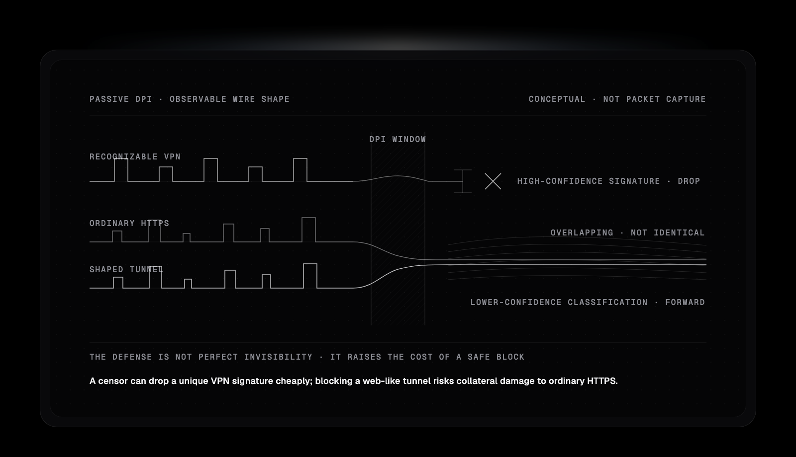

A recognizable VPN trace is classified and dropped. Below it, ordinary HTTPS and a shaped tunnel occupy overlapping observable territory and continue through the same DPI window.

- Best answer to “why does this survive when plain WireGuard/OpenVPN may not?”
- Communicates the economic constraint on the censor: a less specific rule causes more collateral blocking.
- Protocol-agnostic enough for a multiprotocol product.
- Weakness: the two lower traces must not be interpreted as mathematical identity. The copy explicitly says overlap and lower-confidence classification, not invisibility.

### Active Probe

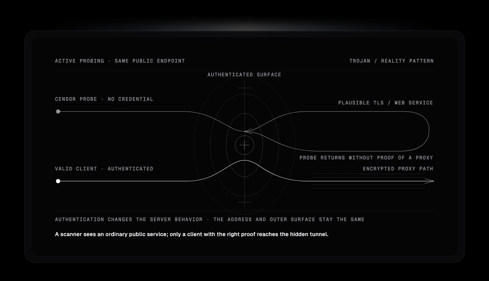

An unauthenticated scanner receives plausible TLS or web behavior from the same endpoint that exposes an encrypted proxy path to a valid client.

- Most faithful visual explanation of Trojan fallback and REALITY's unauthenticated forwarding.
- Branching is by proof of membership, not by transport failure.
- Strongest narrative composition of the set.
- Weakness: it is a concrete product-capability claim. Do not ship it if Spatium cannot actually provide a decoy or target response.

### Layered Tunnel

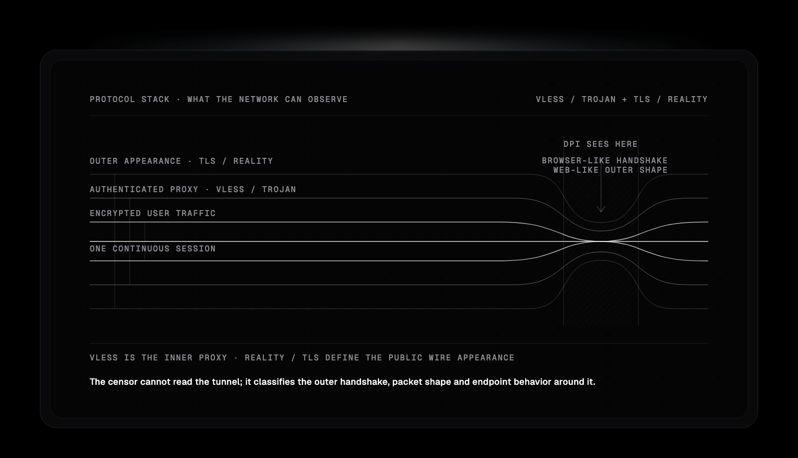

A cutaway separates encrypted user traffic, the authenticated proxy protocol, and the outer TLS/REALITY appearance that the network classifies.

- Best at correcting the vocabulary error that “VLESS itself is the camouflage.”
- Makes the system architecture legible to a technical visitor.
- Weakness: it explains the stack more than the bypass outcome, and its cross-section is a conceptual metaphor rather than a literal packet layout.

Iteration-4 recommendation: **Shared Surface** is the strongest Bypass direction because it directly contrasts cheap protocol blocking with expensive, collision-prone classification without binding Spatium to one implementation. **Active Probe** is visually stronger but narrower and must wait for a truthful capability decision. **Layered Tunnel** is useful as documentation, but it is the weakest marketing image of the three.

## Technical graphic exploration: iteration 5

The earlier rejection of block-heavy diagrams was treated as a temporary composition constraint, not a permanent style rule. With the mechanism now resolved, blocks can carry real semantic roles: observable fields, classifier stages, public endpoint surfaces and nested protocol layers. This set therefore uses blocks wherever they improve grouping and lines only where they communicate flow.

### Classification Threshold

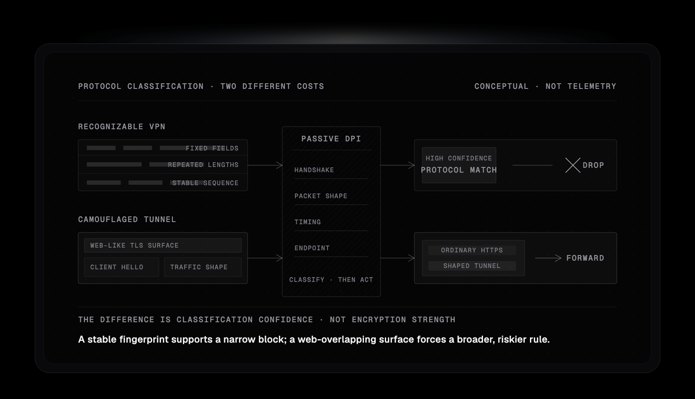

Two connection surfaces pass through the same conceptual DPI classifier. A recognizable VPN exposes stable fields, lengths and sequencing, producing a high-confidence protocol match and a narrow drop rule. A camouflaged tunnel presents a browser-like TLS surface and occupies a lower-confidence region shared with ordinary HTTPS.

- Clearest complete answer to the section's product question.
- Blocks make the sources, evidence, classifier and outcomes immediately separable.
- Keeps the crucial distinction: the difference is classification confidence, not encryption strength.
- Weakness: visually closer to an engineering architecture diagram than an observability graphic. Restraint in borders and labels is necessary to keep it from becoming dashboard UI.

### Public / Hidden Endpoint

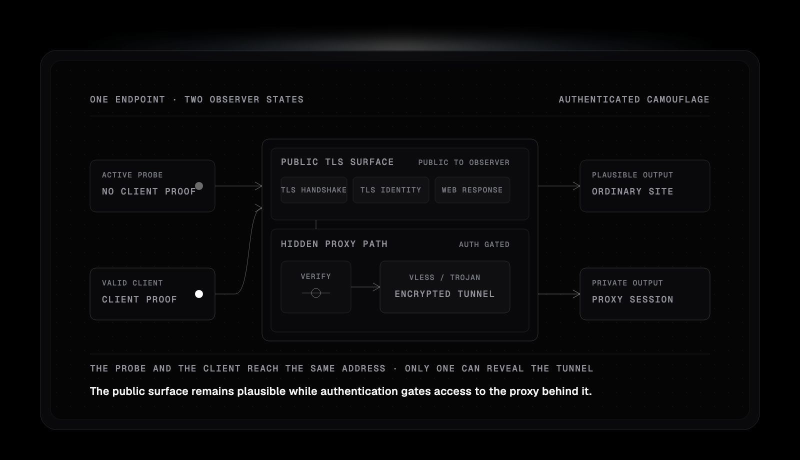

One endpoint contains a plausible public TLS surface and a hidden authenticated proxy path. Both the active probe and the valid client enter through that shared public surface; only valid proof opens the path to the encrypted tunnel.

- Best balance of blocks and directional lines.
- Easier to understand than the earlier optical Probe Gate while preserving its central idea.
- Strongest visual hierarchy of the iteration.
- Weakness: still makes a specific authenticated-camouflage capability claim and cannot represent every protocol supported by a multiprotocol product.

### Protocol Cutaway

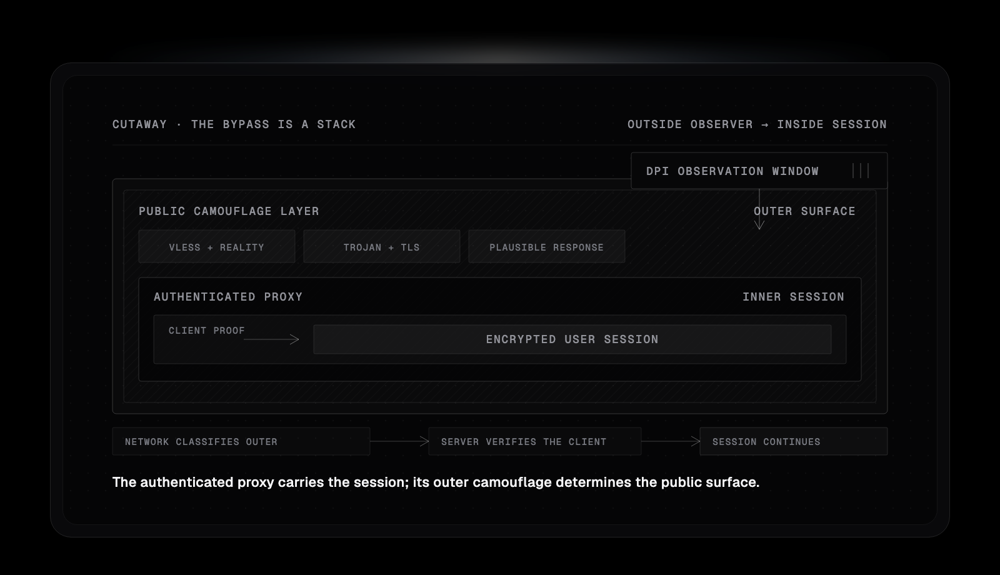

Nested containers separate example public camouflage pairings (`VLESS + REALITY` and `Trojan + TLS`), the generic authenticated proxy and the encrypted user session. A DPI observation window touches the outer surface rather than the inner payload.

- Most precise correction to the misconception that VLESS alone is the camouflage.
- Block nesting maps naturally to actual protocol layering.
- Useful for technically prepared visitors without invented numerical detail.
- Weakness: explains component ownership more strongly than the reason blocking becomes harder. It should not be the sole illustration if broad-audience comprehension is the priority.

Iteration-5 decision: **Public / Hidden Endpoint** was selected after confirming authenticated fallback as the intended capability. Classification Threshold remains the broader, protocol-agnostic alternative, while Protocol Cutaway is better suited to documentation or a secondary technical detail view.

The 1600 × 920 files remain concept references. Production must redraw the chosen desktop composition for the actual ~1060 CSS-pixel container rather than blindly scaling this canvas. Essential labels should remain at least around 12–14 CSS pixels; secondary microcopy that cannot meet that threshold should be removed. Mobile requires a separately composed reduced diagram, not the desktop SVG scaled down.

Production legibility rule: do not scale the desktop SVG down unchanged. At narrower breakpoints, reduce the number of channels or samples, keep technical labels at a readable minimum size, and preserve roughly one device pixel for secondary strokes. Mobile should use a simplified composition, not a miniature desktop diagram.

## Production implementation

The selected Public / Hidden Endpoint diagram is implemented in `src/components/landing/BypassDiagram.tsx` and mounted inside the existing glass container in `src/pages/landing/Bypass.tsx`.

- Desktop preserves the approved routing: the probe enters the public surface directly, while the authenticated client follows a curved route into the same endpoint before verification opens the hidden path.
- Connectors sit in a foreground SVG layer and use compact open chevrons instead of filled arrowheads.
- Semantic blocks use larger radii and opaque near-black fills, preventing the dot field from showing through them.
- Phone and tablet layouts use a separately composed portrait diagram and matching portrait shell rather than shrinking or letterboxing the desktop canvas.
- The diagram remains crisp and non-glowing; Ice Ridge stays an independent decorative WebGL layer outside it.

Halo and Curtain remain documented reserves for later sections and should not be added to Bypass.
